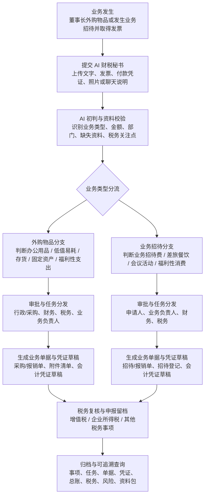

# AI 财税秘书通用业务流程图设计

日期：2026-05-20

## 1. 目标

为 `AI 财税秘书` 增加一套可反复查看的标准业务流程图，覆盖两类高频董事长自发起场景：

- 外购物品
- 业务招待

流程图的目标不是展示系统功能目录，而是告诉操作人员：

- 这个业务从发生到结束的标准流程是什么
- 涉及哪些部门与角色
- 需要哪些单据和资料
- 会形成哪些税务事项
- 会生成哪些凭证和账务结果
- 当前事项已经走到哪一步
- 可以从流程图直接穿透到相关业务页面

该流程图应优先挂载在 `AI 财税秘书` 页面，在提交业务问题、附件或发票时直接显示；同时在事项、单据、税务、凭证等页面中可回看。

## 2. 范围

本设计覆盖：

- 一张通用主流程图
- 两条业务分支：
  - 外购物品
  - 业务招待
- 结构化流程节点模型
- 页面挂载位置
- 页面穿透规则
- 当前事项高亮规则

本设计暂不覆盖：

- OCR 细节
- 大模型提示词细节
- 审批流引擎复杂配置
- PDF 导出细节

## 3. 设计原则

- 共用步骤只定义一次，避免“外购物品”和“业务招待”各自复制整条流程
- 业务差异通过分支泳道表达，而不是拆成两张独立图
- 每个节点必须可结构化，不做纯图片死图
- 每个节点都要能回答四个问题：
  - 谁参与
  - 产出什么
  - 税务上影响什么
  - 系统里去哪里看
- 当前事项进入系统后，应能自动高亮所在步骤和所属分支

## 4. 流程总览

推荐采用：

- 一张主流程图
- 两条业务分支泳道
- 节点展开卡片

流程分为七段：

1. 业务发生
2. 提交 AI 财税秘书
3. AI 初判与资料校验
4. 审批与任务分发
5. 财税处理分支
6. 税务复核与申报留档
7. 归档与可追溯查询

## 5. 标准流程图



## 6. 流程节点定义

### 6.1 通用节点

#### 节点 A：业务发生

- 说明：
  - 董事长在公司外部完成购买或招待行为
  - 取得纸质或电子发票，可能同时存在付款截图、回单、聊天说明、照片
- 参与角色：
  - 董事长
  - 经办人
- 原始资料：
  - 发票
  - 付款记录
  - 商品或招待说明
  - 对方信息
- 页面穿透：
  - `AssistantPage`

#### 节点 B：提交 AI 财税秘书

- 说明：
  - 在 `AI 财税秘书` 中提交文本描述和附件
  - 系统生成一个 `business_event`
- 参与角色：
  - 董事长
  - AI 财税秘书
- 输出对象：
  - 经营事项
  - 分析快照
  - 附件记录
- 页面穿透：
  - `AssistantPage`
  - `EventsPage`

#### 节点 C：AI 初判与资料校验

- 说明：
  - 识别这是“外购物品”还是“业务招待”
  - 识别金额、时间、部门、业务目的、发票类型
  - 判断缺失哪些资料
- 参与角色：
  - AI 财税秘书
  - 财务
- 输出对象：
  - 业务类型建议
  - 风险提示
  - 资料缺失清单
  - 任务拆解建议
- 页面穿透：
  - `AssistantPage`
  - `EventsPage`
  - `RiskPage`

#### 节点 H：税务复核与申报留档

- 说明：
  - 根据业务类型形成税务事项
  - 归入申报批次
  - 执行复核、提交、留档
- 涉及税务：
  - 增值税
  - 企业所得税
  - 个税（如涉及员工报销或补贴口径）
  - 印花税 / 附加税（视业务触发）
- 输出对象：
  - tax_items
  - tax_filing_batches
  - review records
  - archive records
- 页面穿透：
  - `TaxPage`

#### 节点 I：归档与可追溯查询

- 说明：
  - 所有资料进入可追溯状态
  - 可以按事项、单据、凭证、税务、风险、资料包进行回查
- 输出对象：
  - documents
  - vouchers
  - ledger entries
  - report / tax bundles
- 页面穿透：
  - `DocumentsPage`
  - `VouchersPage`
  - `LedgerPage`
  - `ReportsPage`
  - `TaxPage`
  - `RiskPage`

### 6.2 外购物品分支节点

#### 节点 E1：外购物品分支判断

- 判断内容：
  - 办公用品
  - 低值易耗品
  - 存货
  - 固定资产
  - 福利性或不可税前正常扣除支出
- 涉及部门：
  - 董事长
  - 行政 / 采购
  - 财务
- 关键单据：
  - 采购发票
  - 付款截图 / 回单
  - 物品用途说明
  - 验收或领用说明
- 税务关注：
  - 是否可抵扣进项税
  - 是否应资本化
  - 是否属于福利性支出
- 凭证方向：
  - 借：管理费用 / 库存商品 / 固定资产 / 低值易耗品
  - 贷：银行存款 / 其他应付款

#### 节点 F1：外购物品审批与任务分发

- 任务分发：
  - 行政 / 采购确认用途和归属
  - 财务确认入账口径
  - 税务确认发票与抵扣口径
- 输出：
  - 任务树
  - 缺失资料提醒
  - 审批意见

#### 节点 G1：外购物品生成单据与凭证草稿

- 生成对象：
  - 报销单或采购单
  - 附件索引
  - 凭证草稿
  - 固定资产或存货记录（如触发）
- 页面穿透：
  - `DocumentsPage`
  - `VouchersPage`
  - `LedgerPage`

### 6.3 业务招待分支节点

#### 节点 E2：业务招待分支判断

- 判断内容：
  - 业务招待费
  - 差旅餐饮
  - 会议活动支出
  - 福利性消费
- 涉及部门：
  - 董事长
  - 业务部门
  - 财务
  - 税务
- 关键单据：
  - 餐饮或服务发票
  - 付款截图 / 回单
  - 招待对象
  - 招待事由
  - 时间地点说明
- 税务关注：
  - 企业所得税业务招待费扣除限制
  - 增值税是否可抵扣
  - 是否被识别为福利性消费
- 凭证方向：
  - 借：管理费用-业务招待费 / 销售费用-业务招待费 / 管理费用-会议费
  - 贷：银行存款 / 其他应付款

#### 节点 F2：业务招待审批与任务分发

- 任务分发：
  - 申请人补充对象和事由
  - 业务负责人确认业务关联性
  - 财务确认费用归类
  - 税务确认税前扣除与留存资料口径

#### 节点 G2：业务招待生成单据与凭证草稿

- 生成对象：
  - 报销单
  - 招待登记单
  - 税务关注清单
  - 凭证草稿
- 页面穿透：
  - `DocumentsPage`
  - `VouchersPage`
  - `TaxPage`

## 7. 节点结构模型

前端不应把流程图做成纯文本或纯图片，建议使用统一结构：

```ts
type ProcessNode = {
  id: string;
  title: string;
  phase: "common" | "purchase" | "entertainment";
  description: string;
  departments: string[];
  documents: string[];
  taxes: string[];
  vouchers: string[];
  routes: string[];
  status?: "pending" | "current" | "done" | "blocked";
};
```

必要理由：

- 可根据事项类型自动隐藏无关分支
- 可在不同页面重复复用
- 可直接做“点击节点跳转”
- 可标识当前步骤

## 8. 页面接入方案

### 8.1 `AssistantPage`

这是主入口，必须显示。

展示方式：

- 页面顶部显示“标准业务处理流程”
- 默认展示主图
- 如果用户尚未提交事项：
  - 显示通用主流程和两条分支说明
- 如果用户已提交事项：
  - 自动高亮当前识别出的分支
  - 高亮当前所在节点
  - 在流程图下方显示“本次事项涉及部门 / 单据 / 税务 / 凭证”

### 8.2 `EventsPage`

事项详情页显示“流程位置卡”：

- 当前事项类型
- 当前所在步骤
- 下一步骤
- 缺失资料
- 查看完整流程图入口

### 8.3 `DocumentsPage` / `TaxPage` / `VouchersPage` / `RiskPage`

每个详情页保留：

- `返回流程图`
- `查看上下游节点`
- `定位到本节点`

## 9. 穿透规则

每个流程节点都应配置默认跳转：

| 节点 | 默认跳转 |
| --- | --- |
| 业务发生 / 提交秘书 | `/assistant` |
| AI 初判与资料校验 | `/events` |
| 审批与任务分发 | `/tasks` |
| 单据生成 | `/documents` |
| 凭证草稿 | `/vouchers` |
| 税务复核与申报留档 | `/tax` |
| 风险提示 | `/risk` |
| 归档与查询 | `/documents` 或 `/reports` |

后续如需要更强穿透，可以附带具体对象 ID：

- `/events?id=...`
- `/documents?id=...`
- `/tax?batchId=...`
- `/vouchers?id=...`

## 10. 当前事项高亮规则

### 10.1 事项类型判定

如果 `business_event.type` 命中：

- `procurement` / `asset` / `expense`
  - 默认高亮“外购物品”分支
- `business_entertainment` / `travel` / `meeting`
  - 默认高亮“业务招待”分支

### 10.2 当前节点判定

按对象存在情况推导：

- 只有 event，没有 tasks：
  - 当前节点 = AI 初判与资料校验
- 有 tasks，没有 documents：
  - 当前节点 = 审批与任务分发
- 有 documents，没有 vouchers：
  - 当前节点 = 单据生成
- 有 vouchers，没有 tax batch：
  - 当前节点 = 凭证 / 税务处理中
- 有 tax batch，未 archive：
  - 当前节点 = 申报复核与留档
- 已 archive：
  - 当前节点 = 归档完成

## 11. 错误处理与边界

- 如果事项类型无法判断：
  - 仍显示主流程图
  - 不高亮某个业务分支
- 如果多个分支同时命中：
  - 默认先显示主流程，再允许切换查看两个分支
- 如果当前页没有对应对象 ID：
  - 只跳转到模块首页，不强制定位详情
- 如果用户权限不足：
  - 节点可见，但跳转按钮置灰并提示无权限

## 12. 测试要求

需要覆盖：

- 未提交事项时的默认主流程显示
- 外购物品事项的分支高亮
- 业务招待事项的分支高亮
- 节点点击跳转
- 详情页回看流程图
- 当前节点状态推导正确
- 无权限场景下按钮降级

## 13. 推荐实施顺序

1. 建立流程图静态数据定义
2. 建立通用 `ProcessFlowCard` 组件
3. 接入 `AssistantPage`
4. 接入 `EventsPage`
5. 接入 `DocumentsPage` / `TaxPage` / `VouchersPage` / `RiskPage`
6. 加入基于事项详情的高亮逻辑
7. 补测试与帮助文案

## 14. 结论

本功能应被视为：

- 操作引导层
- 业务流程透明层
- 系统对象穿透层

而不是单纯的“帮助说明”。  
它直接服务于董事长交办、操作人员执行、财务税务审核、审计留档四类场景，应作为 `AI 财税秘书` 的核心入口能力之一。
