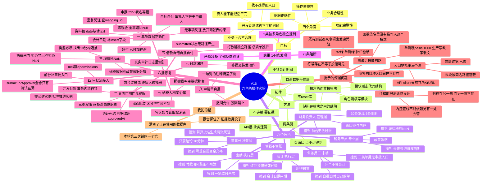
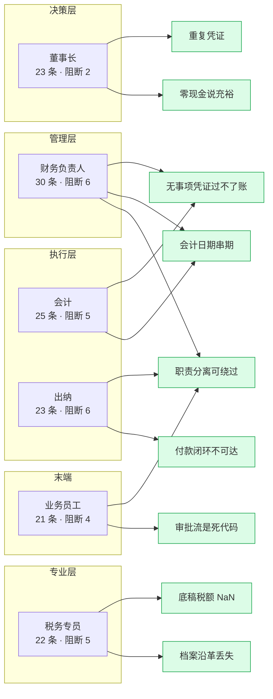

# V16 六角色操作实验 · 思维导图

## 缺陷分布（按角色与严重度）

> 绿色 = 已修并配测试。箭头汇聚处 = 多个角色独立撞到同一缺陷，可信度最高。
> 剩余未修的两类（税率政策实现、其余页面的 403 渲染）不在图上——
> 它们不是「坏了」，是「没做完」。

## 修复前后

| 项目 | 实验前 | 现在 |
|------|--------|------|
| 阻断级缺陷 | 28（其中 21 条已修） | 7（余下属政策实现与逐页整改） |
| 集成测试 | 463 | 475 |
| web 测试 | 142 | 145 |
| 工具护栏 | 74 | 75 |

## 一句话

**开发者测试证明「代码按设计工作」，角色实验检验「设计本身对不对、用户够不够得着」。**
这次 144 条发现里，没有一条是靠再写一遍单元测试能找到的。
